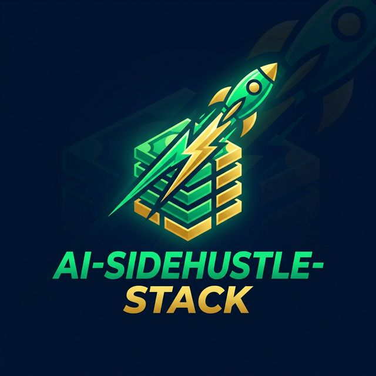

<p align="center">
  
</p>

# 💸 AI-SideHustle-Stack

> **The World's First AI-Powered Venture Machine.** Launch, market, and grow your AI side hustle with a dedicated agentic workforce.

[](https://github.com/RayeesYousufGenAi/ai-sidehustle-stack)
[](https://www.crewai.com/)
[](https://opensource.org/licenses/MIT)

---

## 🚀 The Workflow

**AI-SideHustle-Stack** isn't just a tool; it's a **Managed AI Workforce**. Using the **CrewAI** engine, it orchestrates a specialized crew of agents to take a business concept from "Zero to Viral" in seconds.

### 🤖 Meet the Crew:
1. **🔍 Viral Trend Hunter**: Scans market data to find high-demand, low-competition AI niches.
2. **✍️ Viral Storyteller**: Crafts "Hook-First" marketing copy for X, LinkedIn, and Landing Pages.
3. **📅 Launch Strategist**: Develops a tactical 7-day roadmap for Product Hunt, Indie Hackers, and beyond.

---

## 🔥 Why This Repo?

- **Real-World Agentic Logic**: Demonstrates sequential and parallel task processing via CrewAI.
- **Viral Content Engine**: Optimized for the 2026 social media landscape (short-form hooks, curiosity loops).
- **High ROI Architecture**: Focused on "Wealth-First" automation—designed to maximize launch efficiency.

---

## 🛠️ Stack Intelligence

- **Orchestration**: [CrewAI](https://www.crewai.com/) for multi-agent role-playing and task management.
- **Intelligence**: Powered by **GPT-4o** for advanced strategic reasoning.
- **Frontend**: [Streamlit](https://streamlit.io/) for a real-time venture command center.

---

## 🚀 Deployment Guide

### 1. Requirements
- **Python**: 3.9+
- **OpenAI API Key**: (High-rate limits recommended for best agent performance)

### 2. Fast Install
```bash
git clone https://github.com/RayeesYousufGenAi/ai-sidehustle-stack.git
cd ai-sidehustle-stack
python3 -m venv venv
source venv/bin/activate
pip install -r requirements.txt
```

### 3. Kickoff the Venture
```bash
streamlit run app.py
```
**Recommended Goal**: *"Build an AI-powered lead generation tool for real estate agents in San Francisco."*

---

## 📈 Roadmap
- [ ] **Web Search Integration**: Active Firecrawl/Serper support for real-time market data.
- [ ] **Email Automation**: Automated outreach to potential early adopters.
- [ ] **Multi-Lingual GTM**: Launch strategies for global markets.

---

## 📄 License
MIT License. Happy Building!

---

<p align="center">Launch Faster. Go Viral. Scale Smarter. 💸🚀</p>
